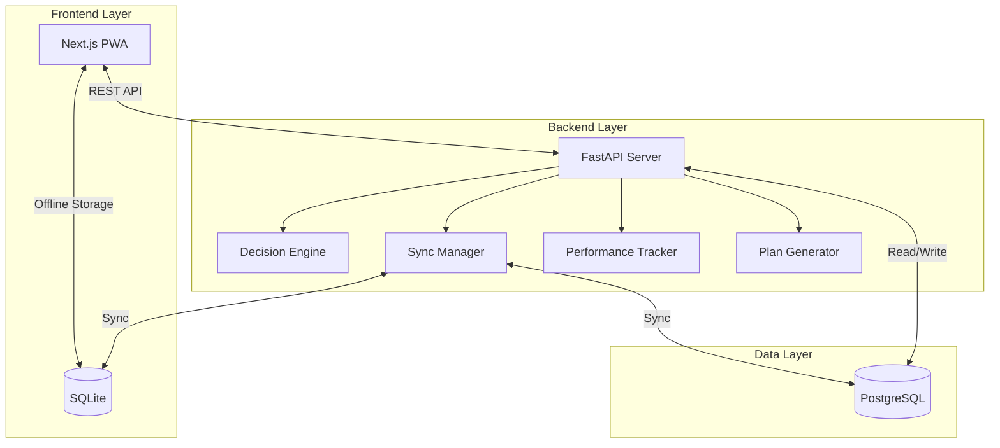
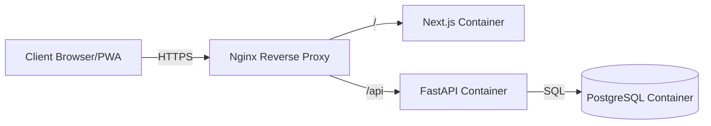

# Design Document: Adaptive Learning Decision Engine

## Overview

The Adaptive Learning Decision Engine is a production-ready offline-first system that provides intelligent, explainable study recommendations to students. The system architecture follows a three-tier design: a React-based Progressive Web App frontend, a FastAPI Python backend, and a dual-database strategy (SQLite for offline, PostgreSQL for cloud sync).

The core innovation is the deterministic Decision Engine algorithm that computes priority scores based on exam weightage, student weakness, dependency unlocking potential, and time cost. Every recommendation includes full explainability, showing students exactly why a topic was chosen and what improvement they can expect.

The system operates fully offline, with intelligent synchronization when connectivity is restored. This ensures students in areas with unreliable internet can use the system without interruption.

## Architecture

### High-Level Architecture



### Technology Stack

**Frontend:**
- Next.js 14 (React 18) with App Router
- TailwindCSS for styling
- PWA configuration with service workers
- IndexedDB wrapper for SQLite in browser
- React Query for API state management

**Backend:**
- FastAPI (Python 3.11+)
- Pydantic for data validation
- SQLAlchemy ORM for database operations
- Alembic for database migrations
- JWT for authentication

**Databases:**
- SQLite (local offline storage)
- PostgreSQL 15 (cloud storage)

**DevOps:**
- Docker and Docker Compose
- Nginx as reverse proxy
- Environment-based configuration

### Deployment Architecture



## Components and Interfaces

### 1. Authentication Service

**Responsibility:** Handle user authentication, authorization, and session management.

**Interface:**
```python
class AuthService:
    def register_user(username: str, password: str, role: UserRole, 
                     grade: Optional[int] = None) -> User
    def login(username: str, password: str) -> AuthToken
    def verify_token(token: str) -> User
    def logout(token: str) -> bool
    def hash_password(password: str) -> str
    def verify_password(password: str, hashed: str) -> bool
```

**Key Design Decisions:**
- Use bcrypt for password hashing with salt rounds = 12
- JWT tokens with 24-hour expiration
- Role-based access control (RBAC) with three roles: student, teacher, admin
- Tokens stored in HTTP-only cookies for security

### 2. Performance Tracker

**Responsibility:** Record student question attempts and compute mastery scores.

**Interface:**
```python
class PerformanceTracker:
    def record_attempt(student_id: int, question_id: int, 
                      answer: str, is_correct: bool,
                      time_taken: float, confidence: int) -> Attempt
    
    def calculate_mastery_score(student_id: int, concept_id: int) -> float
    
    def get_student_performance(student_id: int) -> PerformanceReport
    
    def get_concept_attempts(student_id: int, concept_id: int) -> List[Attempt]
    
    def get_mistake_patterns(student_id: int, concept_id: int) -> MistakeAnalysis
```

**Mastery Score Calculation:**
```
mastery_score = (
    0.5 * accuracy_rate +
    0.2 * speed_factor +
    0.2 * confidence_factor +
    0.1 * consistency_factor
) * 100

where:
- accuracy_rate = correct_attempts / total_attempts
- speed_factor = min(1.0, expected_time / avg_time_taken)
- confidence_factor = avg_confidence / 5.0
- consistency_factor = 1.0 - (std_dev_of_recent_scores / mean_of_recent_scores)
```

### 3. Knowledge Graph Manager

**Responsibility:** Manage syllabus structure, prerequisites, and topic relationships.

**Interface:**
```python
class KnowledgeGraphManager:
    def create_topic(name: str, parent_id: Optional[int],
                    prerequisites: List[int], weightage: float,
                    estimated_hours: float) -> Topic
    
    def get_topic_hierarchy() -> TopicTree
    
    def get_prerequisites(topic_id: int) -> List[Topic]
    
    def get_dependent_topics(topic_id: int) -> List[Topic]
    
    def check_prerequisites_met(student_id: int, topic_id: int,
                               threshold: float = 60.0) -> bool
    
    def get_unlockable_topics(student_id: int) -> List[Topic]
```

**Graph Structure:**
- Directed Acyclic Graph (DAG) to prevent circular dependencies
- Each node stores: topic_id, name, parent_id, prerequisites[], weightage, estimated_hours
- Edges represent prerequisite relationships
- Support for multi-level hierarchy: Subject → Chapter → Topic → Concept

### 4. Decision Engine (Core Algorithm)

**Responsibility:** Compute the optimal next topic for a student to study.

**Interface:**
```python
class DecisionEngine:
    def compute_priority_score(student_id: int, topic_id: int) -> float
    
    def get_next_recommendation(student_id: int) -> Recommendation
    
    def get_top_n_recommendations(student_id: int, n: int) -> List[Recommendation]
    
    def explain_recommendation(student_id: int, topic_id: int) -> Explanation

class Recommendation:
    topic_id: int
    topic_name: str
    priority_score: float
    expected_marks_gain: float
    estimated_study_hours: float
    explanation: Explanation

class Explanation:
    exam_weightage: float
    current_accuracy: float
    mastery_score: float
    dependencies_unlocked: int
    weakness_score: float
    reasoning_text: str
```

**Priority Score Algorithm:**

```
Priority_Score = (Exam_Weightage × Importance_Factor) / 
                 (Weakness_Score × Dependency_Factor × Mastery_Level × Time_Cost)

where:
- Exam_Weightage: percentage of exam from this topic (0-100)
- Importance_Factor: 1.0 + (days_until_exam < 30 ? 0.5 : 0.0)
- Weakness_Score: max(0.1, 1.0 - mastery_score/100)
- Dependency_Factor: 1.0 / (1.0 + num_topics_unlocked)
- Mastery_Level: max(0.1, mastery_score/100)
- Time_Cost: estimated_hours / available_hours_per_day
```

**Algorithm Steps:**
1. Get all topics where prerequisites are met (mastery ≥ 60%)
2. For each eligible topic, compute priority score
3. Sort topics by priority score (descending)
4. Return top topic with explanation
5. Cache computation for 5 minutes per student

**Performance Optimization:**
- Memoize mastery score lookups
- Pre-compute dependency counts
- Use database indexes on student_id, topic_id
- Target: < 200ms computation time

### 5. Explanation Generator

**Responsibility:** Generate human-readable explanations for recommendations.

**Interface:**
```python
class ExplanationGenerator:
    def generate_explanation(student_id: int, topic_id: int,
                           priority_score: float) -> str
    
    def format_reasoning(exam_weightage: float, accuracy: float,
                        dependencies: int, marks_gain: float) -> str
```

**Explanation Template:**
```
"Study {topic_name} because:
• {exam_weightage}% of exam questions come from this topic
• Your current accuracy is {accuracy}% (needs improvement)
• Mastering this unlocks {dependencies} future chapters
• Expected improvement: +{marks_gain} marks
• Estimated study time: {hours} hours"
```

### 6. Study Plan Generator

**Responsibility:** Create personalized daily and weekly study schedules.

**Interface:**
```python
class StudyPlanGenerator:
    def generate_daily_plan(student_id: int, date: datetime) -> DailyPlan
    
    def generate_weekly_plan(student_id: int, start_date: datetime) -> WeeklyPlan
    
    def generate_exam_countdown_plan(student_id: int, exam_date: datetime) -> ExamPlan
    
    def adjust_plan_for_progress(student_id: int, plan_id: int) -> StudyPlan

class DailyPlan:
    date: datetime
    topics: List[TopicAllocation]
    total_hours: float
    revision_topics: List[int]

class TopicAllocation:
    topic_id: int
    topic_name: str
    allocated_hours: float
    priority_score: float
    goals: List[str]
```

**Plan Generation Algorithm:**
1. Get student's available hours per day
2. Get top N recommendations (N = hours / avg_topic_time)
3. Allocate time proportional to priority scores
4. Reserve 20% of time for revision of previously studied topics
5. Ensure no single topic gets > 50% of daily time
6. For weekly plans, distribute topics across days with spaced repetition

**Revision Cycle:**
- Review topics after 1 day, 3 days, 7 days, 14 days (spaced repetition)
- Allocate 15-20 minutes per revision session
- Prioritize topics with declining mastery scores

### 7. Sync Manager

**Responsibility:** Handle offline-online data synchronization with conflict resolution.

**Interface:**
```python
class SyncManager:
    def queue_operation(operation: SyncOperation) -> None
    
    def sync_to_cloud() -> SyncResult
    
    def sync_from_cloud(student_id: int) -> SyncResult
    
    def resolve_conflict(local_record: Any, cloud_record: Any) -> Any
    
    def get_sync_status() -> SyncStatus

class SyncOperation:
    operation_type: str  # 'create', 'update', 'delete'
    table_name: str
    record_id: int
    data: dict
    timestamp: datetime
    synced: bool

class SyncStatus:
    pending_operations: int
    last_sync_time: datetime
    sync_state: str  # 'synced', 'pending', 'syncing', 'error'
```

**Synchronization Strategy:**
1. **Offline Mode:** All operations write to SQLite and queue in sync_operations table
2. **Online Detection:** Poll network status every 30 seconds
3. **Sync Process:**
   - Fetch pending operations from queue (ordered by timestamp)
   - For each operation, attempt to apply to PostgreSQL
   - On success, mark operation as synced
   - On conflict, apply resolution strategy
4. **Conflict Resolution:** Latest-attempt-wins based on timestamp
5. **Retry Logic:** Exponential backoff for failed syncs (1s, 2s, 4s, 8s, max 60s)

**Tables to Sync:**
- student_profiles
- question_attempts
- concept_mastery
- study_plans
- user_preferences

### 8. Teacher Analytics Service

**Responsibility:** Provide class-wide analytics and predictions.

**Interface:**
```python
class TeacherAnalyticsService:
    def get_class_performance(class_id: int) -> ClassPerformance
    
    def get_weak_topics(class_id: int, threshold: float = 40.0) -> List[TopicAnalysis]
    
    def identify_at_risk_students(class_id: int) -> List[StudentRisk]
    
    def predict_exam_results(class_id: int) -> ExamPrediction
    
    def get_student_comparison(student_id: int, class_id: int) -> Comparison

class ClassPerformance:
    class_id: int
    avg_mastery_by_topic: Dict[int, float]
    total_students: int
    active_students: int
    total_attempts: int

class StudentRisk:
    student_id: int
    student_name: str
    risk_level: str  # 'high', 'medium', 'low'
    weak_topics: List[int]
    avg_mastery: float
```

**Prediction Algorithm:**
```
predicted_score = sum(topic_weightage * min(100, mastery_score * 1.1))
                  for all topics in syllabus

risk_level = 'high' if avg_mastery < 40
           = 'medium' if 40 <= avg_mastery < 60
           = 'low' if avg_mastery >= 60
```

## Data Models

### User Model
```python
class User:
    id: int (PK)
    username: str (unique, indexed)
    password_hash: str
    role: str  # 'student', 'teacher', 'admin'
    created_at: datetime
    last_login: datetime
```

### Student Profile
```python
class StudentProfile:
    id: int (PK)
    user_id: int (FK -> User.id)
    grade: int
    target_exam: str
    exam_date: datetime
    available_hours_per_day: float
    class_id: int (FK -> Class.id, nullable)
```

### Topic
```python
class Topic:
    id: int (PK)
    name: str
    parent_id: int (FK -> Topic.id, nullable)
    exam_weightage: float  # 0-100
    estimated_hours: float
    description: str
    created_at: datetime
```

### TopicPrerequisite
```python
class TopicPrerequisite:
    id: int (PK)
    topic_id: int (FK -> Topic.id)
    prerequisite_topic_id: int (FK -> Topic.id)
    minimum_mastery: float  # default 60.0
```

### Concept
```python
class Concept:
    id: int (PK)
    topic_id: int (FK -> Topic.id)
    name: str
    description: str
```

### Question
```python
class Question:
    id: int (PK)
    concept_id: int (FK -> Concept.id)
    question_text: str
    question_type: str  # 'mcq', 'numerical', 'true_false'
    options: JSON  # for MCQ
    correct_answer: str
    difficulty: str  # 'easy', 'medium', 'hard'
    expected_time_seconds: int
```

### QuestionAttempt
```python
class QuestionAttempt:
    id: int (PK)
    student_id: int (FK -> StudentProfile.id, indexed)
    question_id: int (FK -> Question.id, indexed)
    answer: str
    is_correct: bool
    time_taken_seconds: float
    confidence: int  # 1-5
    timestamp: datetime (indexed)
    synced: bool  # for offline sync
```

### ConceptMastery
```python
class ConceptMastery:
    id: int (PK)
    student_id: int (FK -> StudentProfile.id, indexed)
    concept_id: int (FK -> Concept.id, indexed)
    total_attempts: int
    correct_attempts: int
    avg_time_seconds: float
    avg_confidence: float
    mastery_score: float  # 0-100
    last_updated: datetime
    
    # Composite unique constraint on (student_id, concept_id)
```

### StudyPlan
```python
class StudyPlan:
    id: int (PK)
    student_id: int (FK -> StudentProfile.id)
    plan_type: str  # 'daily', 'weekly', 'exam_countdown'
    start_date: datetime
    end_date: datetime
    topics: JSON  # List of TopicAllocation
    created_at: datetime
    is_active: bool
```

### SyncOperation
```python
class SyncOperation:
    id: int (PK)
    operation_type: str  # 'create', 'update', 'delete'
    table_name: str
    record_id: int
    data: JSON
    timestamp: datetime (indexed)
    synced: bool (indexed)
    retry_count: int
    last_error: str (nullable)
```

### Database Indexes

**Critical Indexes for Performance:**
- `idx_attempts_student_timestamp` on QuestionAttempt(student_id, timestamp)
- `idx_attempts_question` on QuestionAttempt(question_id)
- `idx_mastery_student_concept` on ConceptMastery(student_id, concept_id)
- `idx_sync_pending` on SyncOperation(synced, timestamp)
- `idx_user_username` on User(username)

## API Endpoints

### Authentication
- `POST /api/auth/register` - Register new user
- `POST /api/auth/login` - Login and get token
- `POST /api/auth/logout` - Logout and invalidate token
- `GET /api/auth/me` - Get current user info

### Student Performance
- `POST /api/attempts` - Record question attempt
- `GET /api/attempts/student/{student_id}` - Get all attempts
- `GET /api/mastery/student/{student_id}` - Get mastery scores
- `GET /api/mastery/student/{student_id}/concept/{concept_id}` - Get concept mastery

### Recommendations
- `GET /api/recommendations/next/{student_id}` - Get next topic recommendation
- `GET /api/recommendations/top/{student_id}?n=5` - Get top N recommendations
- `GET /api/recommendations/explain/{student_id}/{topic_id}` - Get explanation

### Study Plans
- `POST /api/plans/daily/{student_id}` - Generate daily plan
- `POST /api/plans/weekly/{student_id}` - Generate weekly plan
- `POST /api/plans/exam/{student_id}` - Generate exam countdown plan
- `GET /api/plans/student/{student_id}` - Get active plans

### Knowledge Graph
- `GET /api/topics` - Get all topics
- `GET /api/topics/{topic_id}` - Get topic details
- `GET /api/topics/{topic_id}/prerequisites` - Get prerequisites
- `GET /api/topics/unlockable/{student_id}` - Get unlockable topics

### Teacher Analytics
- `GET /api/analytics/class/{class_id}` - Get class performance
- `GET /api/analytics/class/{class_id}/weak-topics` - Get weak topics
- `GET /api/analytics/class/{class_id}/at-risk` - Get at-risk students
- `GET /api/analytics/class/{class_id}/predictions` - Get exam predictions

### Sync
- `POST /api/sync/upload` - Upload pending operations
- `GET /api/sync/download/{student_id}` - Download latest data
- `GET /api/sync/status/{student_id}` - Get sync status

### Questions
- `GET /api/questions/concept/{concept_id}` - Get questions for concept
- `GET /api/questions/{question_id}` - Get question details


## Correctness Properties

*A property is a characteristic or behavior that should hold true across all valid executions of a system—essentially, a formal statement about what the system should do. Properties serve as the bridge between human-readable specifications and machine-verifiable correctness guarantees.*

### Performance Tracking Properties

**Property 1: Attempt Recording Completeness**
*For any* question submission with answer, time, and confidence data, recording the attempt should result in a stored record containing all provided fields.
**Validates: Requirements 1.1**

**Property 2: Multiple Attempt Preservation**
*For any* question and student, submitting N attempts should result in exactly N stored attempt records with distinct timestamps.
**Validates: Requirements 1.2**

**Property 3: Mastery Score Bounds**
*For any* concept and student with recorded attempts, the calculated mastery score must be between 0 and 100 inclusive.
**Validates: Requirements 1.3**

**Property 4: Mistake Pattern Storage**
*For any* concept with student attempts, mistake patterns should be stored and retrievable for that concept.
**Validates: Requirements 1.5**

### Knowledge Graph Properties

**Property 5: Graph Structure Integrity**
*For any* topic with prerequisites, the prerequisite relationships should form a directed acyclic graph (no cycles).
**Validates: Requirements 2.1**

**Property 6: Prerequisite Enforcement**
*For any* topic with unmet prerequisites (mastery < threshold), that topic should not appear in the list of recommended topics.
**Validates: Requirements 2.2**

**Property 7: Weightage Validation**
*For any* topic, the exam weightage value must be between 0 and 100 inclusive, and attempting to store invalid weightage should be rejected.
**Validates: Requirements 2.3**

**Property 8: Dependency Unlocking**
*For any* topic T with dependent topics D1, D2, ..., Dn, when T reaches mastery threshold, all topics in {D1, D2, ..., Dn} should appear in the unlockable topics list (assuming their other prerequisites are met).
**Validates: Requirements 2.4**

**Property 9: Hierarchy Support**
*For any* topic hierarchy of depth N (where N ≥ 3), the system should correctly store and retrieve parent-child relationships at all levels.
**Validates: Requirements 2.5**

**Property 10: Study Time Validation**
*For any* topic, the estimated study time must be a positive number, and attempting to store non-positive values should be rejected.
**Validates: Requirements 2.6**

### Decision Engine Properties

**Property 11: Priority Score Formula Correctness**
*For any* student and eligible topic with known weightage, weakness, dependencies, mastery, and time cost, the computed priority score should exactly match the formula: (Exam_Weightage × Importance) / (Weakness_Score × Dependency_Factor × Mastery_Level × Time_Cost).
**Validates: Requirements 3.1**

**Property 12: Highest Priority Selection**
*For any* set of eligible topics with computed priority scores, the recommended topic should be the one with the maximum priority score.
**Validates: Requirements 3.2**

**Property 13: Deterministic Recommendations**
*For any* student state (performance data, mastery scores, available topics), computing recommendations twice without state changes should produce identical results.
**Validates: Requirements 3.3**

**Property 14: Prerequisites Filter**
*For any* recommended topic, all of its prerequisites must have mastery scores at or above the threshold (default 60%).
**Validates: Requirements 3.4**

**Property 15: Recommendation Completeness**
*For any* recommendation response, it must contain topic_id, topic_name, expected_marks_gain, and estimated_study_hours fields.
**Validates: Requirements 3.5**

### Explanation Properties

**Property 16: Explanation Completeness**
*For any* topic recommendation, the accompanying explanation must include exam weightage, current accuracy, number of dependencies unlocked, and expected improvement values.
**Validates: Requirements 4.1, 4.2**

**Property 17: Recommendation-Explanation Coupling**
*For any* recommendation generated by the system, there must exist a corresponding explanation with matching topic_id.
**Validates: Requirements 4.3**

**Property 18: Formula Component Visibility**
*For any* recommendation explanation, all components of the priority score formula (weightage, weakness, dependencies, mastery, time cost) must be present in the explanation text or data.
**Validates: Requirements 4.5**

### Study Planning Properties

**Property 19: Time Constraint Adherence**
*For any* generated study plan and student with available_hours_per_day = H, the total allocated hours in any single day must not exceed H.
**Validates: Requirements 5.1, 5.6**

**Property 20: Priority-Based Allocation**
*For any* daily study plan with multiple topics, topics should be ordered by descending priority score.
**Validates: Requirements 5.2**

**Property 21: Revision Inclusion**
*For any* weekly study plan for a student with previously studied topics, at least one revision session for a previously studied topic must be included.
**Validates: Requirements 5.3**

**Property 22: Exam Proximity Adaptation**
*For any* two study plans generated for the same student at different times (T1 far from exam, T2 close to exam), the plan at T2 should allocate more time to higher-weightage topics than the plan at T1.
**Validates: Requirements 5.4**

**Property 23: Performance-Driven Regeneration**
*For any* student with an active study plan, if mastery scores change significantly (>15% for any topic), regenerating the plan should produce a different topic allocation.
**Validates: Requirements 5.5**

### Synchronization Properties

**Property 24: Offline Storage**
*For any* student data modification (attempt, mastery update, plan creation), the data must be written to the local SQLite database regardless of network status.
**Validates: Requirements 6.1**

**Property 25: Offline Operation Queuing**
*For any* data modification performed while offline, a corresponding sync operation record must be created in the sync queue with synced=false.
**Validates: Requirements 6.2**

**Property 26: Sync Trigger**
*For any* pending sync operations in the queue, transitioning from offline to online state should trigger synchronization within 30 seconds.
**Validates: Requirements 6.3**

**Property 27: Conflict Resolution Strategy**
*For any* sync conflict between local and cloud records, the record with the later timestamp should be retained in both databases after resolution.
**Validates: Requirements 6.4**

**Property 28: Offline Functionality**
*For any* core operation (get recommendation, record attempt, generate plan) performed while offline, the operation should complete successfully using local data.
**Validates: Requirements 6.5**

**Property 29: Sync Status Accuracy**
*For any* sync state (all synced, pending operations, actively syncing), the displayed sync status should accurately reflect the current state.
**Validates: Requirements 6.6**

### Analytics Properties

**Property 30: Class Average Calculation**
*For any* class with N students and their mastery scores for a topic, the displayed average should equal the sum of all mastery scores divided by N.
**Validates: Requirements 7.1**

**Property 31: At-Risk Student Identification**
*For any* student with average mastery score below 40% in topics marked as critical, that student should appear in the at-risk students list.
**Validates: Requirements 7.2**

**Property 32: Exam Prediction Bounds**
*For any* class, the predicted exam score should be between 0 and 100 inclusive, calculated as the weighted sum of mastery scores by topic weightage.
**Validates: Requirements 7.3**

**Property 33: Topic Ranking**
*For any* class analytics view showing weak topics, topics should be ordered by ascending average mastery score (weakest first).
**Validates: Requirements 7.4**

**Property 34: Analytics Filtering**
*For any* analytics filter applied (by student, topic, or time period), the returned data should contain only records matching all filter criteria.
**Validates: Requirements 7.5**

### Authentication Properties

**Property 35: Authentication Requirement**
*For any* protected API endpoint, requests without valid authentication tokens should be rejected with 401 Unauthorized status.
**Validates: Requirements 8.1**

**Property 36: Role Assignment**
*For any* successful login, the returned session must include a role field with value in {'student', 'teacher', 'admin'}.
**Validates: Requirements 8.2**

**Property 37: Authorization Enforcement**
*For any* teacher-only endpoint, requests from users with role='student' should be rejected with 403 Forbidden status.
**Validates: Requirements 8.3**

**Property 38: Password Hashing**
*For any* stored user password, the stored value must not equal the plaintext password (must be hashed).
**Validates: Requirements 8.5**

**Property 39: Token Validation**
*For any* valid authentication token, requests to protected endpoints using that token should succeed (not return 401).
**Validates: Requirements 8.6**

### Question Interface Properties

**Property 40: Answer Validation**
*For any* question with a defined correct answer, submitting that exact answer should result in is_correct=true, and submitting any other answer should result in is_correct=false.
**Validates: Requirements 9.2**

**Property 41: Time Recording Validity**
*For any* question attempt, the recorded time_taken value must be positive and less than a reasonable maximum (e.g., 1 hour = 3600 seconds).
**Validates: Requirements 9.3**

**Property 42: Retry Permission**
*For any* question answered incorrectly by a student, the system should allow that student to submit another attempt for the same question.
**Validates: Requirements 9.4**

**Property 43: Question Type Support**
*For any* question with type in {'mcq', 'numerical', 'true_false'}, the system should correctly process and validate answers according to that type's rules.
**Validates: Requirements 9.6**

### Progress Tracking Properties

**Property 44: Accuracy Calculation**
*For any* student with N total attempts and C correct attempts, the displayed accuracy percentage should equal (C / N) × 100.
**Validates: Requirements 10.3**

**Property 45: Concept Grouping**
*For any* topic with concepts C1, C2, ..., Cn, viewing that topic's breakdown should display mastery scores for all concepts in {C1, C2, ..., Cn}.
**Validates: Requirements 10.4**

**Property 46: Trend Detection**
*For any* topic with mastery score change > 15% (increase or decrease) in the past 7 days, that topic should be highlighted in the progress view.
**Validates: Requirements 10.5**

### Data Model Properties

**Property 47: Student Profile Schema**
*For any* stored student profile, it must contain fields: id, user_id, grade, target_exam, exam_date, and available_hours_per_day.
**Validates: Requirements 12.1**

**Property 48: Concept Mastery Schema**
*For any* stored concept mastery record, it must contain fields: concept_id, attempts, accuracy, avg_time, and mastery_score.
**Validates: Requirements 12.2**

**Property 49: Topic Graph Schema**
*For any* stored topic, it must contain fields: topic_id, prerequisites (array), weightage, and estimated_time.
**Validates: Requirements 12.3**

**Property 50: Attempt Schema**
*For any* stored question attempt, it must contain fields: student_id, question_id, answer, is_correct, time_taken, confidence, and timestamp.
**Validates: Requirements 12.4**

**Property 51: Referential Integrity**
*For any* attempt record with student_id=S and question_id=Q, there must exist a student with id=S and a question with id=Q in the database.
**Validates: Requirements 12.5**

### API Design Properties

**Property 52: HTTP Method Compliance**
*For any* API endpoint, it should use GET for reads, POST for creates, PUT for updates, and DELETE for deletions.
**Validates: Requirements 13.1**

**Property 53: JSON Response Format**
*For any* API response, the content-type header should be 'application/json' and the body should be valid JSON.
**Validates: Requirements 13.2**

**Property 54: Error Status Codes**
*For any* API error condition (validation failure, not found, unauthorized, server error), the response status code should match the error type (400, 404, 401, 500 respectively).
**Validates: Requirements 13.4**

**Property 55: Rate Limiting**
*For any* client making more than N requests per minute (where N is the rate limit), subsequent requests should be rejected with 429 Too Many Requests status.
**Validates: Requirements 13.6**

### Health Check Properties

**Property 56: Health Endpoint Availability**
*For any* running service instance, the health check endpoint should return 200 OK status when the service is operational.
**Validates: Requirements 15.5**

## Error Handling

### Error Categories

**1. Validation Errors**
- Invalid input data (negative mastery scores, invalid dates, etc.)
- Missing required fields
- Type mismatches
- Response: 400 Bad Request with detailed error message

**2. Authentication Errors**
- Missing or invalid tokens
- Expired sessions
- Response: 401 Unauthorized

**3. Authorization Errors**
- Insufficient permissions for requested operation
- Role-based access violations
- Response: 403 Forbidden

**4. Not Found Errors**
- Requested resource doesn't exist
- Invalid IDs
- Response: 404 Not Found

**5. Conflict Errors**
- Duplicate records (username already exists)
- Constraint violations
- Response: 409 Conflict

**6. Server Errors**
- Database connection failures
- Unexpected exceptions
- Algorithm computation errors
- Response: 500 Internal Server Error

### Error Response Format

All errors follow a consistent JSON structure:
```json
{
  "error": {
    "code": "VALIDATION_ERROR",
    "message": "Human-readable error description",
    "details": {
      "field": "specific_field_name",
      "reason": "Detailed reason for failure"
    },
    "timestamp": "2024-01-15T10:30:00Z"
  }
}
```

### Sync Error Handling

**Offline Queue Errors:**
- If sync fails, operation remains in queue
- Retry with exponential backoff: 1s, 2s, 4s, 8s, 16s, 32s, 60s (max)
- After 5 failed retries, mark operation for manual review
- Log error details for debugging

**Conflict Resolution:**
- Compare timestamps of conflicting records
- Keep record with latest timestamp
- Log conflict resolution for audit trail
- Notify user if significant data was overwritten

### Algorithm Error Handling

**Decision Engine Errors:**
- If no eligible topics found: Return message "Complete prerequisites first"
- If priority score computation fails: Log error, use fallback (highest weightage topic)
- If mastery data missing: Treat as 0% mastery

**Study Plan Generation Errors:**
- If available hours too low: Suggest minimum viable plan with warning
- If exam date in past: Return error "Invalid exam date"
- If no topics available: Return empty plan with guidance message

## Testing Strategy

### Dual Testing Approach

The system requires both unit testing and property-based testing for comprehensive coverage:

**Unit Tests:**
- Specific examples demonstrating correct behavior
- Edge cases (empty inputs, boundary values, null handling)
- Error conditions and exception handling
- Integration points between components
- Focus on concrete scenarios that are easy to understand

**Property-Based Tests:**
- Universal properties that hold for all inputs
- Comprehensive input coverage through randomization
- Minimum 100 iterations per property test
- Each test references its design document property
- Focus on invariants and mathematical properties

### Property-Based Testing Configuration

**Library Selection:**
- Python backend: Use `hypothesis` library
- TypeScript/JavaScript frontend: Use `fast-check` library

**Test Configuration:**
```python
# Python example with hypothesis
from hypothesis import given, settings
import hypothesis.strategies as st

@settings(max_examples=100)
@given(
    student_id=st.integers(min_value=1, max_value=10000),
    topic_id=st.integers(min_value=1, max_value=1000)
)
def test_priority_score_formula(student_id, topic_id):
    """
    Feature: adaptive-learning-decision-engine
    Property 11: Priority Score Formula Correctness
    """
    # Test implementation
    pass
```

**Test Tagging:**
Every property test must include a comment tag:
```
Feature: adaptive-learning-decision-engine, Property {N}: {property_text}
```

### Test Coverage Requirements

**Backend (Python):**
- Unit test coverage: > 80%
- Property test coverage: All 56 properties implemented
- Integration tests: API endpoints, database operations, sync logic

**Frontend (TypeScript):**
- Unit test coverage: > 75%
- Component tests: All major UI components
- Integration tests: API calls, offline storage, PWA functionality

**End-to-End Tests:**
- Critical user flows: Login → Solve questions → Get recommendation → View plan
- Offline-online transition scenarios
- Multi-device sync scenarios

### Test Data Strategy

**Fixtures:**
- Sample syllabus with 50 topics across 5 subjects
- 500 sample questions covering all difficulty levels
- 20 sample students with varied performance profiles
- Pre-computed mastery scores for testing

**Generators (for property tests):**
- Random student profiles with valid constraints
- Random question attempts with realistic timing
- Random topic graphs (ensuring DAG property)
- Random mastery scores (0-100 range)

### Performance Testing

While not part of correctness properties, performance should be validated:
- Load testing: 1000 concurrent users
- Recommendation computation: < 200ms (95th percentile)
- API response times: < 100ms for simple queries
- Database query optimization: Use EXPLAIN ANALYZE

### Testing Workflow

1. **Development:** Write unit tests alongside code
2. **Property Tests:** Implement after core logic is complete
3. **Integration Tests:** Test component interactions
4. **E2E Tests:** Validate complete user workflows
5. **Performance Tests:** Run before deployment
6. **Regression Tests:** Run full suite on every commit

### Continuous Integration

- Run all tests on every pull request
- Block merges if tests fail
- Generate coverage reports
- Run property tests with increased iterations (500) in CI
- Performance benchmarks on staging environment
